# Guía para Modificar un Camión de Bomberos 🚒✨

A continuación, se explican los pasos necesarios para realizar correctamente la modificación de un camión de bomberos. Sigue cada paso con atención para evitar problemas durante el proceso.

---

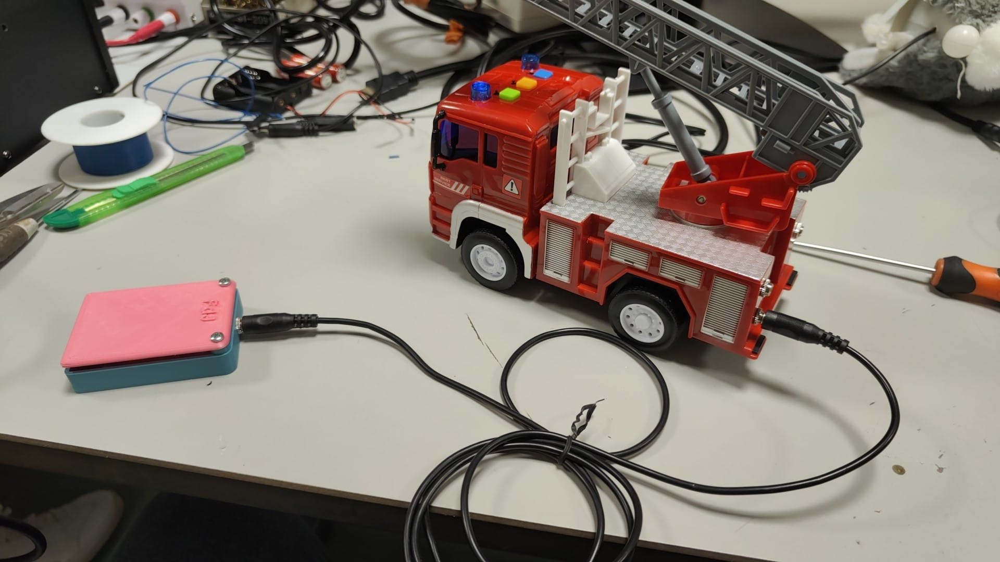

---

## 1. Retirar el papel del portapilas
El primer paso consiste en quitar el papel del portapilas.  
Es muy importante que guardes este papel en un lugar seguro, ya que será necesario volver a colocarlo después de finalizar la modificación.

---

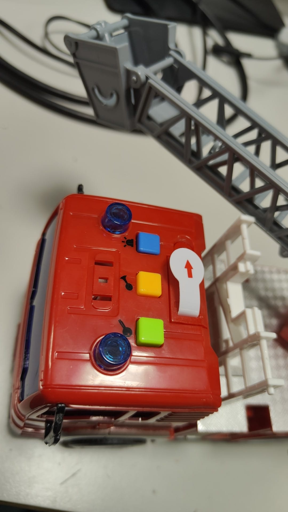

---

## 2. Quitar los tornillos inferiores
A continuación, localiza los tornillos que se encuentran en la parte inferior del camión.  
Retíralos con cuidado utilizando un destornillador adecuado.  
Una vez que los tornillos estén fuera, la carcasa superior del camión debería soltarse sin mayor dificultad.

---

## 3. Retirar el tornillo oculto bajo la pegatina del morro
En la parte frontal del camión (el morro), hay un tornillo que está oculto detrás de una pegatina.  
Para acceder a este tornillo:

- Retira la pegatina con mucho cuidado para evitar que se dañe.
- Una vez retirada, desatornilla el tornillo oculto.

Es fundamental que guardes la pegatina en un lugar seguro, ya que deberás volver a colocarla una vez que termines la modificación.

---

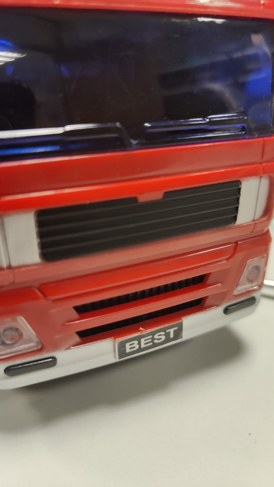

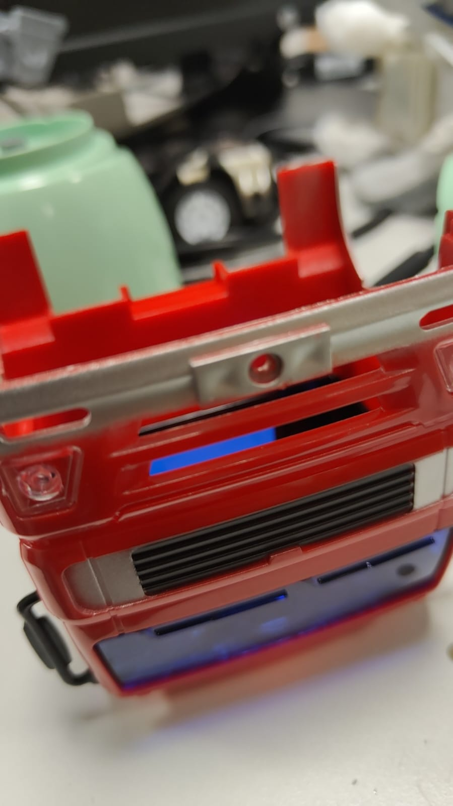

---

## 4. Acceder a la placa PCB
Con la carcasa superior retirada, ahora podemos acceder a la placa PCB.  
Es importante manejar esta placa con mucho cuidado, ya que los botones de colores del juguete (verde, amarillo y azul) pueden caerse fácilmente durante este proceso.  

---

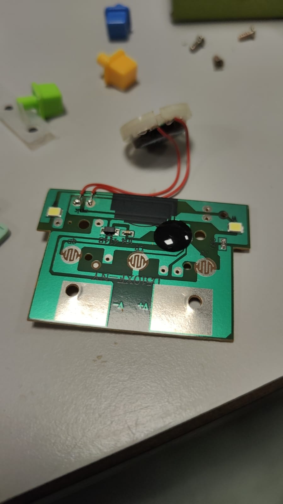

---

## 5. Preparar los cables
Para continuar, necesitamos preparar 4 cables que sean más largos que el juguete. Es mejor que sobre cable a que falte, para facilitar las conexiones posteriores.  
Estos cables se conectarán de la siguiente manera:  

1. **Pulsador verde**: Un cable se conectará al botón verde.  
2. **Pulsador amarillo**: Otro cable irá al botón amarillo.  
3. **Pulsador azul**: Un tercer cable se conectará al botón azul.  
4. **V+**: El cuarto cable deberá conectarse en el punto de alimentación positiva (**V+**) de la placa PCB.

---

### Nota importante:
Se recomienda marcar con cinta adhesiva el cable que se conecte a **V+**. Esto será muy útil más adelante, ya que facilitará la conexión de los **conectores jack empotrables** durante el proceso de soldadura.

---

## 6. Soldar la placa PCB
Una vez que todos los cables estén correctamente conectados y soldados a la placa PCB, verifica que las conexiones sean firmes y seguras.  

Cuando la soldadura esté completa, coloca nuevamente la placa en su lugar dentro del juguete. Asegúrate de que los botones de colores (verde, amarillo y azul) estén bien posicionados antes de continuar.

---

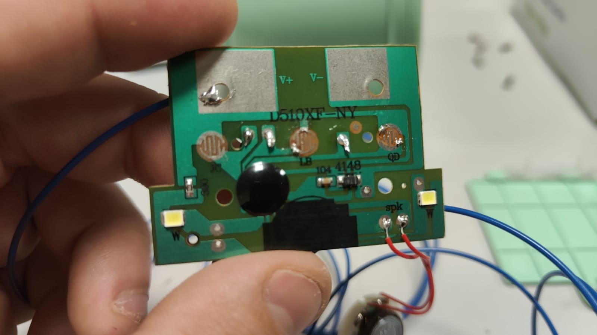

---

## 7. Ensamblar la carcasa
Con la placa PCB colocada, comienza a ensamblar nuevamente la carcasa del juguete.  

1. **Paso clave**: Al colocar el tornillo del morro, no olvides volver a poner la pegatina en su lugar. Esto garantizará que el juguete conserve su aspecto original.  

2. Asegúrate de que todos los tornillos estén correctamente ajustados y de que la carcasa esté bien cerrada.

---

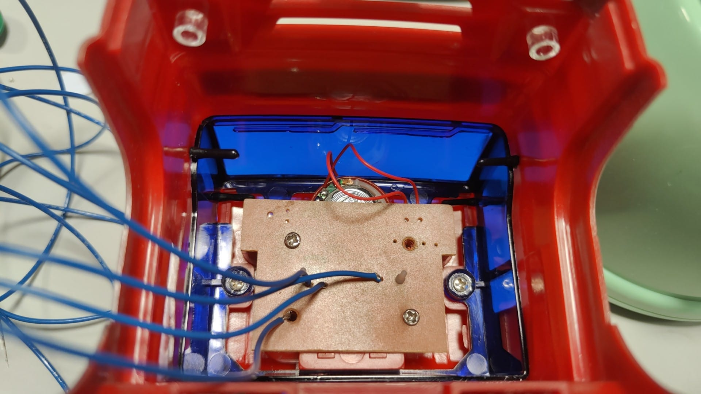

---

## 8. Soldar conectores jack
Antes de colocar la parte trasera del juguete, necesitamos soldar un conector jack a cada cable de los pulsadores. Sigue estos pasos:  

1. **Conectar cada pulsador a un jack**:  
   - Soldaremos un conector jack a cada uno de los cables que provienen de los pulsadores verde, amarillo y azul.  
   - Esto permitirá que cada pulsador se conecte externamente mediante los jacks.  

2. **Conectar el cable de V+**:  
   - El cable marcado como **V+** debe soldarse a uno de los conectores jack.  
   - Con dos trozos pequeños de cable, conecta el **V+** a los otros dos conectores jack restantes.  
   - Esto asegura que la alimentación positiva esté disponible para todos los jacks.  

3. Verifica que todas las conexiones estén sólidas antes de continuar con el ensamblaje.  

---

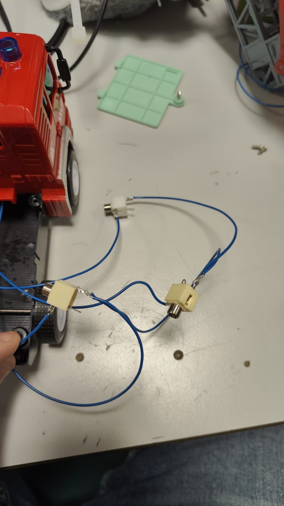

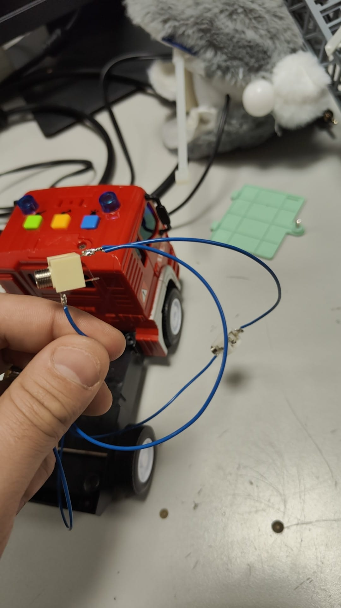

---

## 9. Hacer los taladros en la carcasa trasera
Para poder insertar los conectores jack, necesitaremos hacer tres taladros en la carcasa trasera del juguete. Sigue estos pasos:

1. **Marcar los puntos de perforación**:  
   Marca cuidadosamente los tres lugares en la parte trasera donde quieres hacer los agujeros. Asegúrate de que los taladros estén alineados y sean lo suficientemente grandes para que los conectores jack encajen bien.

2. **Usar una broca pequeña**:  
   Comienza con una broca pequeña para hacer un agujero inicial fino. Esto ayudará a guiar la broca más grande y garantizará que los agujeros sean precisos.

3. **Pasar la broca número 6**:  
   Después de hacer el agujero fino, cambia a una broca de tamaño **número 6**. Utiliza esta broca para agrandar los agujeros hasta el tamaño adecuado para insertar los conectores jack.  

---

## 10. Pasar los cables por la placa negra
Con los taladros realizados y los conectores jack listos, ahora es el momento de pasar los cables a través de la placa negra y hacia los agujeros que hemos hecho en la carcasa trasera.

1. **Pasar los cables por la placa negra**:  
   Los cables que provienen de los pulsadores y del V+ deben ser guiados a través de la placa negra. Asegúrate de que los cables no se queden atrapados o enredados en otras partes del juguete.

2. **Llevar los cables a los agujeros**:  
   Una vez los cables estén pasados por la placa negra, dirígelos hacia los tres agujeros que hemos hecho en la carcasa trasera.  
   - Cada cable debe pasar por su respectivo agujero para conectar los jacks correctamente.

---

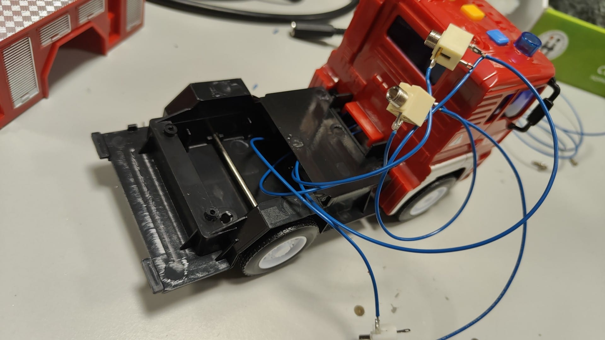

---

## 11. Probar y jugar
Una vez que todo esté montado y ensamblado correctamente, ¡es hora de probar y disfrutar de tu camión de bomberos modificado!

1. **Verifica las conexiones**:  
   Asegúrate de que todos los cables estén correctamente conectados y que los jacks encajen bien en sus agujeros.

2. **Prueba los pulsadores**:  
   Conecta todo y presiona los pulsadores para comprobar que funcionan correctamente. Si todo está bien, deberías ver los resultados de las modificaciones que realizaste.

3. **¡A jugar!**  
   ¡Ya está listo para usarse! Ahora solo queda disfrutar del camión de bomberos modificado y jugar con todas sus nuevas funciones.

---

¡Enhorabuena! Has completado la modificación con éxito. 🚒🎉

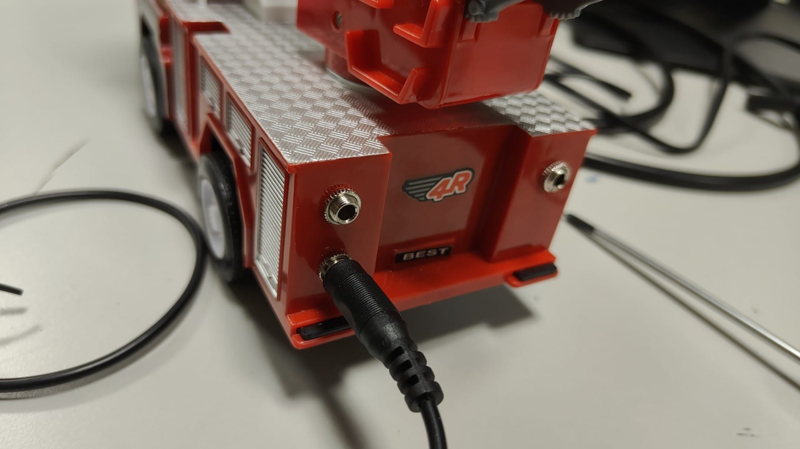

---

Siguiendo estos pasos con paciencia y atención, podrás desmontar el camión de bomberos de manera adecuada y estarás listo para proceder con las modificaciones. Si necesitas ayuda con los pasos posteriores, ¡no dudes en consultarlo! 😊 [Realizar consulta]([https://github.com/tu-usuario/tu-repo/issues](https://github.com/WeAdapta/Camion_de_Bomberos/issues))

---

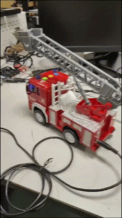

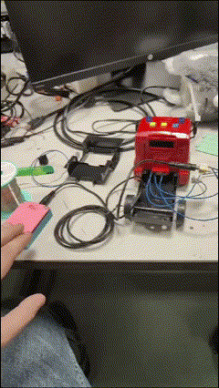

